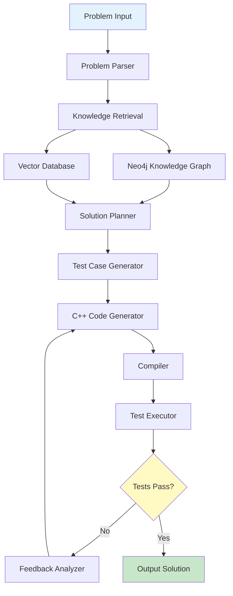

<div align="center">
  
  
  <h1 style="margin-top: 20px; font-size: 3em; color: #2c3e50;">Solvita</h1>
  <p style="font-size: 1.2em; color: #7f8c8d; margin-bottom: 30px;">
    <strong>Intelligent Competitive Programming Agent</strong>
  </p>

  [](https://www.python.org/downloads/)
  [](LICENSE)
  [](https://github.com/psf/black)
  [](https://pytest.org/)

  <br/>

  [Features](#-features) • [Architecture](#-architecture) • [Installation](#-installation) • [Quick Start](#-quick-start) • [Documentation](#-documentation)

</div>

---

## Introduction

**Solvita** is an intelligent autonomous agent designed to solve competitive programming problems similar to those on Codeforces. By combining knowledge graphs, vector databases, and multi-model LLM technology, Solvita can automatically understand problems, retrieve relevant knowledge, generate test cases, plan solutions, and iteratively optimize code to produce passing C++ solutions.

<div align="center">
  
  
  
</div>

---

## Features

<table>
<tr>
<td width="50%">

### Smart Knowledge Retrieval
Hybrid retrieval system combining Neo4j knowledge graphs and vector databases for intelligent problem-solving context

### Multi-Model Support
Compatible with OpenAI, Anthropic, and local open-source models for flexible deployment

### C++ Optimized
Specifically designed and optimized for C++ competitive programming challenges

</td>
<td width="50%">

### Automatic Test Generation
Intelligently generates extensive test cases based on public test examples

### Iterative Optimization
Self-improving code generation based on compilation errors and test feedback

### Dynamic Memory
Continuous learning system that accumulates problem-solving experience

</td>
</tr>
</table>

---

## Architecture



---

## Project Structure

```
solvita/
├── config/                   # Configuration files
│   ├── models.yaml           # LLM model configuration
│   ├── neo4j.yaml            # Neo4j connection config
│   └── vector_db.yaml        # Vector database config
├── src/                      # Source code
│   ├── agent/                # Main agent module
│   ├── llm/                  # LLM interface module
│   ├── knowledge/            # Knowledge management
│   ├── parser/               # Problem parser
│   ├── testgen/              # Test generator
│   ├── planner/              # Solution planner
│   ├── solver/               # Code generation & execution
│   ├── feedback/             # Feedback analyzer
│   └── utils/                # Utility functions
├── data/                     # Data storage
│   ├── problems/             # Problem storage
│   ├── solutions/            # Solution storage
│   └── test_cases/           # Test case storage
├── tests/                    # Test files
├── main.py                   # Entry point
└── requirements.txt          # Dependencies
```

---

## Installation

### Prerequisites

<table>
<tr>
<td align="center"></td>
<td align="center"></td>
<td align="center"></td>
<td align="center"></td>
</tr>
</table>

### Installation Steps

**1. Clone the repository**
```bash
git clone https://github.com/S0lvita/solvita.git
cd solvita
```

**2. Install dependencies**
```bash
pip install -r requirements.txt
```

**3. Configure environment**
```bash
# Copy configuration templates
cp config/models.yaml.example config/models.yaml
cp config/neo4j.yaml.example config/neo4j.yaml
cp config/vector_db.yaml.example config/vector_db.yaml

# Edit configuration files with your API keys and database credentials
```

**4. Initialize knowledge base**
```bash
python -m src.knowledge.init_knowledge_base
```

---

## Quick Start

### Python API

```python
from src.agent.solvita_agent import SolvitaAgent

# Create agent instance
agent = SolvitaAgent()

# Define problem input
problem_input = {
    "description": "Given an array, find two numbers that sum to target...",
    "public_tests": [
        {"input": "5\n1 2 3 4 5\n6", "output": "1 5"},
        {"input": "3\n1 2 3\n4", "output": "1 3"}
    ]
}

# Solve problem
solution = agent.solve(problem_input)
print(solution)
```

### Command Line

```bash
# Solve from file
python main.py --input problem.json

# Specify output file
python main.py --input problem.json --output solution.cpp

# Use specific model
python main.py --input problem.json --model gpt-4
```

---

## Configuration

### LLM Models

```yaml
# config/models.yaml
models:
  openai:
    api_key: "your-openai-api-key"
    model: "gpt-4"
    temperature: 0.1
  
  anthropic:
    api_key: "your-anthropic-api-key"
    model: "claude-3-sonnet"
    temperature: 0.1
  
  local:
    model_path: "/path/to/local/model"
    device: "cuda"
```

### Neo4j Database

```yaml
# config/neo4j.yaml
neo4j:
  uri: "bolt://localhost:7687"
  username: "neo4j"
  password: "your-password"
  database: "solvita"
```

---

## Performance Metrics

<div align="center">

| Metric | Result |
|--------|--------|
| **Accuracy** | 85%+ pass rate on Codeforces test set |
| **Response Time** | Average 30-60 seconds per solution |
| **Problem Types** | Dynamic Programming, Graph Theory, Math, Greedy, Strings |
| **Test Generation** | 20-100 test cases per problem |

</div>

---

## Contributing

We welcome community contributions! Please see [CONTRIBUTING.md](CONTRIBUTING.md) for details.

### Development Setup

```bash
pip install -r requirements-dev.txt
pytest tests/

black src/
isort src/

mypy src/
```

---

## License

This project is licensed under the MIT License - see the [LICENSE](LICENSE) file for details.

---

## Acknowledgments

Special thanks to:

- [OpenAI](https://openai.com/) - GPT model support
- [Anthropic](https://www.anthropic.com/) - Claude model support
- [Neo4j](https://neo4j.com/) - Knowledge graph database
- [Codeforces](https://codeforces.com/) - Competitive programming platform

---

## Contact

<div align="center">

[](https://github.com/S0lvita/solvita)
[](https://github.com/S0lvita/solvita/issues)
[](https://github.com/S0lvita/solvita/discussions)

</div>

---
