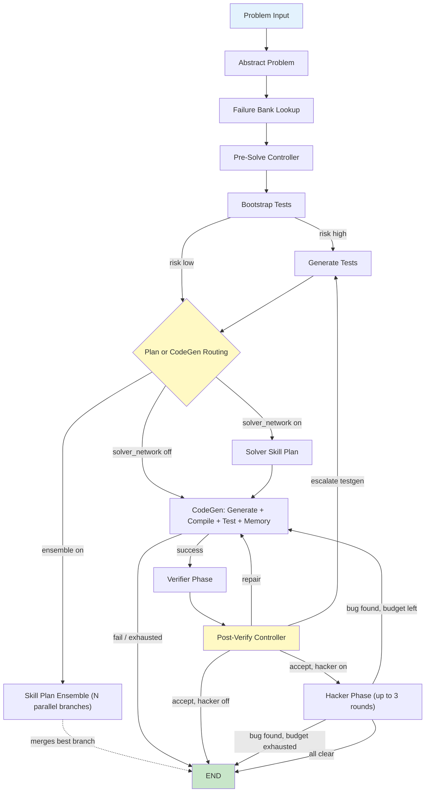

<div align="center">
  
  
  <h1 style="margin-top: 20px; font-size: 3em; color: #2c3e50;">Solvita</h1>
  <p style="font-size: 1.2em; color: #7f8c8d; margin-bottom: 30px;">
    <strong>Intelligent Competitive Programming Agent</strong>
  </p>

  [](https://www.python.org/downloads/)
  [](LICENSE)
  [](https://github.com/psf/black)
  [](https://pytest.org/)

  <br/>

  [Features](#features) • [Architecture](#architecture) • [Installation](#installation) • [Quick Start](#quick-start) • [CLI & Dashboard](#cli--dashboard) • [Memory System](#memory-system) • [Project Structure](#project-structure)

</div>

---

## Introduction

**Solvita** is an autonomous agent for solving competitive programming problems (Codeforces-style). It runs a multi-phase **LangGraph** workflow — Abstract → TestGen → CodeGen → Verify → Hack — backed by a **trainable contextual-bandit memory** system, **sandboxed C++ execution**, and iterative **SEARCH/REPLACE** code repair. On top of the Python core there is an interactive **terminal CLI** and a **web dashboard** for launching and visualizing runs, including a built-in Codeforces problem importer.

---

## Features

<table>
<tr>
<td width="50%">

### Multi-Phase Workflow
Abstract → TestGen → (optional Solver Skill Plan) → CodeGen → Verifier → Hacker, with risk-aware routing and automatic repair loops at every phase boundary

### Trainable Memory
Contextual-bandit network across `plan`, `solve`, `oracle`, and `hack` namespaces that learns which strategies work for which problem types

### C++ Sandboxed Execution
Resource-limited compilation and execution with `rlimit` sandboxing (CPU, memory, file size, process limits) on Linux/WSL2

### Multi-Model LLM Support
Works with any OpenAI-compatible API, Anthropic, or Azure/DashScope, with per-role model overrides in a single config file

</td>
<td width="50%">

### Automatic Test Generation
Bootstraps a fast, trusted test suite first, then escalates to full generation (generators, validators, custom checkers) when needed

### SEARCH/REPLACE Patching
Iterative code repair via structured patches instead of full rewrites, guided by failure feedback and a cross-run failure bank

### Skill-Graph Solver Network (optional)
Retrieves similar solved problems via embedding similarity and proposes a skill DAG to steer code generation, with an optional N-way ensemble

### Adversarial Hack Testing
Post-success adversarial phase that stress-tests solutions to find edge-case bugs and loops back into CodeGen when one is found

</td>
</tr>
</table>

---

## Architecture



This diagram omits the fine-grained inner retry loop inside CodeGen for readability: `generate_code → compile_code → run_tests → update_best_solution → unified_check → update_{plan,solve,oracle}_memory → analyze_feedback → generate_code`. Every routing decision (repair vs. escalate vs. accept, hack loop vs. terminal failure) is a conditional edge driven by `SolvitaState`, defined in `src/nodes/routing.py`. See the docstring at the top of `src/graph/workflow.py` for the exact node/edge wiring.

---

## Installation

### Prerequisites

- **Python 3.10+**
- **g++ or clang++** (C++17 support) — sandboxed `rlimit` execution requires Linux/WSL2; on Windows, compilation falls back to plain `subprocess.run()` with no resource limits
- An OpenAI-compatible, Anthropic, or Azure OpenAI LLM API endpoint
- **Node.js 18+** (only needed for the CLI and dashboard frontend)

### Steps

```bash
# 1. Clone
git clone https://github.com/NJU-LINK/Solvita.git
cd Solvita

# 2. Install Python dependencies
pip install -r requirements.txt

# 3. Configure LLM credentials (choose one method)

# Option A: config file
cp config/models.yaml.example config/models.yaml
# Edit config/models.yaml with your base_url + api_key (+ optional llm.roles per node)

# Option B: environment variables
export SOLVITA_BASE_URL="https://api.openai.com/v1"
export SOLVITA_API_KEY="sk-..."
export SOLVITA_MODEL="gpt-4"
```

> `config/models.yaml` is gitignored — never commit a real `api_key` there. See [CONTRIBUTING.md](CONTRIBUTING.md) for the pre-commit hook that blocks accidental key leaks.

### Embedding Backend (Skill-Graph Similarity)

Only needed when `solver_network.enabled: true`. `skill_graph/question_similarity.py` supports multiple backends, configured under `embedding:` in `config/models.yaml`:

```yaml
embedding:
  provider: "azure_openai"         # or "openai_compatible" | "sentence_transformers"
  model: "text-embedding-3-small"  # or a local HF model id
```

For local embeddings, additionally run `pip install sentence-transformers`. Environment variables (`SOLVITA_EMBEDDING_PROVIDER`, `SOLVITA_EMBEDDING_MODEL`, `SOLVITA_ST_DEVICE`, `SOLVITA_EMBEDDING_AZURE_*`) override the YAML.

---

## Quick Start

### Python API

```python
from src.graph.workflow import run_workflow

result = run_workflow(
    raw_problem={
        "description": "Given an array, find two numbers that sum to target...",
        "time_limit": 2000,
        "space_limit": 256,
        "public_tests": [
            {"input": "5\n1 2 3 4 5\n6", "output": "1 5"},
        ],
    },
    config={
        "max_iterations": 5,
        "max_hack_rounds": 3,
        "solver_network": {"enabled": True},
        "trainable_memory": {"enabled": True},
    },
)

print(result["solution"]["code"])
print(f"Pass rate: {result['tests']['pass_rate']:.1%}")
```

### Command Line

```bash
python main.py --input examples/problem_input_example.json --output solution.cpp

# or describe a problem inline instead of pointing at a JSON file
python main.py --problem-description "Given N, return N" --output solution.cpp
```

Runtime nested configs default to `config/solver_network.yaml` and `config/trainable_memory.yaml`; override any key at call time via `run_workflow(..., config=...)` or `python main.py --config <dir>`.

---

## CLI & Dashboard

### Terminal CLI (`cli/`)

An Ink/React terminal frontend that streams live phase progress (Abstract → TestGen → CodeGen → Hacker) while the Python backend solves a problem, plus a Codeforces search-and-import tab. Full setup and usage: [cli/README.md](cli/README.md).

```bash
cd cli
npm install && npm run build && npm link   # registers the `solvita` command
cd ..

export SOLVITA_API_KEY="sk-..."
./run_solvita.sh solve examples/problem_input_example.json
```

See [USAGE.zh-CN.md](USAGE.zh-CN.md) for a detailed Chinese walkthrough of the CLI + backend setup.

### Web Dashboard (`dashboard/`)

A FastAPI backend (`dashboard/backend/`) plus a React/Vite frontend (`dashboard/frontend/`, using `@xyflow/react` for graph layout) that lets you launch runs, browse and import Codeforces problems, and watch the LangGraph workflow execute live as an animated DAG over a WebSocket feed, with replay of past runs.

```bash
# Backend
pip install -r dashboard/backend/requirements.txt
python -m dashboard.backend.server

# Frontend (separate terminal)
cd dashboard/frontend
npm install && npm run dev
```

---

## Memory System

See [docs/memory_architecture.md](docs/memory_architecture.md) and [docs/MEMORY_SYSTEM_GUIDE.md](docs/MEMORY_SYSTEM_GUIDE.md) for full details, or [docs/trainable-memory-network-guide.zh-CN.md](docs/trainable-memory-network-guide.zh-CN.md) for a Chinese deep-dive into where the trained artifacts live and how to detach them.

The trainable memory uses a **contextual bandit** that learns which strategies work for which problem types. Active namespaces are `plan`, `solve`, `oracle`, and `hack` (the legacy `test` settlement path has been retired). Each namespace has:

- **SQLite store** for items and events
- **Sparse linear policy** with feature-item edge weights
- **Event logging** for offline analysis and batch training

Offline trainers (see `scripts/`):

```bash
python3 scripts/train_hacker.py --dataset <path>.jsonl --data-dir data/memory
python3 scripts/train_oracle.py --dataset <path>.jsonl --data-dir data/memory
```

### Skill-Graph Solver Network (optional)

When `solver_network.enabled: true`, `skill_graph/` retrieves similar previously-solved problems by embedding similarity and proposes a skill DAG (`skill_graph/graph.py`, `inference.py`, `rl_rollout.py`) that augments the CodeGen prompt. `src/skill_graph_train/` holds the offline RL training pipeline for this network's edge weights; `config/solver_network.yaml` controls retrieval size, sampling temperature, and the optional N-way ensemble (`ensemble_skill_plans`) that runs several skill-plan + CodeGen/Hacker branches in parallel and merges the best one.

---

## Project Structure

```
Solvita/
├── config/
│   ├── models.yaml.example     # Copy to models.yaml and fill in credentials
│   ├── solver_network.yaml     # Skill-graph runtime defaults and toggles
│   ├── trainable_memory.yaml   # Trainable memory runtime defaults and toggles
│   ├── prompt_template.yaml    # Prompt templates used by nodes
│   └── tag_whitelist.yaml      # Allowed algorithmic tags for the abstract node
├── src/
│   ├── graph/
│   │   ├── state.py             # SolvitaState TypedDict + config defaults
│   │   └── workflow.py          # LangGraph workflow definition (see Architecture)
│   ├── llm/
│   │   └── unified_client.py    # OpenAI/Anthropic/Azure/DashScope-compatible LLM client
│   ├── memory/                  # Trainable contextual-bandit memory (plan/solve/oracle/hack)
│   ├── nodes/                   # One file per workflow node (abstract_problem, generate_code,
│   │                            # compile_code, run_tests, verifier_phase, hack_test, routing, ...)
│   ├── solver_network/          # Runtime adapter wiring skill_graph/ into the workflow nodes
│   ├── skill_graph_train/       # Offline skill-graph RL training pipeline
│   ├── codeforces/              # Codeforces problem fetch/import (catalog.py, importer.py)
│   ├── failure_bank/            # Cross-run failure lookup service
│   ├── hacker/                  # Sandboxed hack-candidate execution runtime
│   ├── oracle/                  # Test-oracle memory/selector internals
│   ├── benchmark/                # Benchmark pipeline modes + reporting
│   └── utils/
│       ├── cpp_execution.py    # rlimit-sandboxed compile/run
│       └── patch_utils.py      # SEARCH/REPLACE block parser
├── skill_graph/                 # Skill graph data structure, inference, RL rollout, training
├── skills/                      # C++ algorithm snippets (*.md) referenced by solve memory
├── cli/                         # Ink/React terminal frontend (see cli/README.md)
├── dashboard/
│   ├── backend/                 # FastAPI server + WebSocket run streaming
│   └── frontend/                # React/Vite DAG visualization UI
├── docs/                        # Memory system architecture + guides
├── scripts/                     # Offline trainers, benchmark tooling, dataset builders
├── examples/                    # Sample problem JSON for Quick Start
├── data/                        # Sample problems (data/problem/) + gitignored runtime data
├── tests/                       # pytest suite, mirrors src/ layout
├── main.py                      # CLI entry point (Python backend)
├── run_solvita.sh                # Convenience wrapper: pins python venv, forwards to CLI
└── requirements.txt
```

---

## Testing

```bash
pytest tests/
pytest --cov=src tests/
```

The test suite (`tests/`) mirrors the `src/` layout, with dedicated coverage for the graph/workflow, individual nodes, the memory system, the skill-graph solver network, the Codeforces importer, the failure bank, and the dashboard backend.

---

## License

This project is licensed under the MIT License - see the [LICENSE](LICENSE) file for details.

---

## Acknowledgments

- [LangGraph](https://github.com/langchain-ai/langgraph) - Workflow orchestration
- [OpenAI](https://openai.com/) - GPT model support
- [Anthropic](https://www.anthropic.com/) - Claude model support
- [Codeforces](https://codeforces.com/) - Competitive programming platform

---
