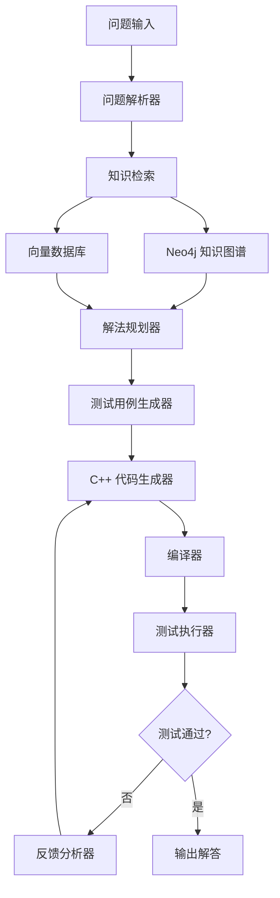

# Solvita

<div align="center">
  
  
  [](https://www.python.org/downloads/)
  [](LICENSE)
  [](https://github.com/psf/black)
  [](https://pytest.org/)
</div>

## 🚀 简介

**Solvita** 是一个智能算法竞赛自动解决 Agent，专门设计用于解决类似 Codeforces 的算法竞赛问题。通过结合知识图谱、向量数据库和多模型 LLM 技术，Solvita 能够自动理解问题、检索相关知识、生成测试用例、规划解法并迭代优化，最终生成通过测试的 C++ 解答。

## ✨ 核心特性

- 🧠 **智能知识检索**: 基于 Neo4j 知识图谱和向量数据库的混合检索
- 🔄 **多模型支持**: 支持 OpenAI、Anthropic 和本地开源模型
- 🎯 **C++ 专用**: 专门针对 C++ 算法竞赛优化
- 🧪 **自动测试生成**: 基于 public test 智能生成大量测试用例
- 🔁 **迭代优化**: 基于编译错误和测试反馈的自动代码优化
- 📊 **动态记忆**: 持续学习和积累解题经验

## 🏗️ 系统架构



## 📁 项目结构

```
solvita/
├── config/                 # 配置文件
│   ├── models.yaml        # LLM 模型配置
│   ├── neo4j.yaml         # Neo4j 连接配置
│   └── vector_db.yaml     # 向量数据库配置
├── src/                   # 源代码
│   ├── agent/             # 主 Agent 模块
│   ├── llm/               # LLM 接口模块
│   ├── knowledge/         # 知识管理模块
│   ├── parser/            # 问题解析模块
│   ├── testgen/           # 测试生成模块
│   ├── planner/           # 解法规划模块
│   ├── solver/            # 代码生成与执行模块
│   ├── feedback/          # 反馈分析模块
│   └── utils/             # 工具模块
├── data/                  # 数据存储
│   ├── problems/          # 问题存储
│   ├── solutions/         # 解答存储
│   └── test_cases/        # 测试用例存储
├── tests/                 # 测试文件
├── main.py               # 入口文件
└── requirements.txt      # 依赖包
```

## 🛠️ 安装与配置

### 环境要求

- Python 3.8+
- Neo4j 4.0+
- C++ 编译器 (g++ 或 clang++)
- 向量数据库 (ChromaDB 或 FAISS)

### 安装步骤

1. **克隆项目**
   ```bash
   git clone https://github.com/S0lvita/solvita.git
   cd solvita
   ```

2. **安装依赖**
   ```bash
   pip install -r requirements.txt
   ```

3. **配置环境**
   ```bash
   # 复制配置文件模板
   cp config/models.yaml.example config/models.yaml
   cp config/neo4j.yaml.example config/neo4j.yaml
   cp config/vector_db.yaml.example config/vector_db.yaml
   
   # 编辑配置文件，填入您的 API 密钥和数据库连接信息
   ```

4. **初始化知识库**
   ```bash
   python -m src.knowledge.init_knowledge_base
   ```

## 🚀 快速开始

### 基本使用

```python
from src.agent.solvita_agent import SolvitaAgent

# 创建 Agent 实例
agent = SolvitaAgent()

# 定义问题输入
problem_input = {
    "description": "给定一个数组，找到两个数的和等于目标值...",
    "public_tests": [
        {"input": "5\n1 2 3 4 5\n6", "output": "1 5"},
        {"input": "3\n1 2 3\n4", "output": "1 3"}
    ]
}

# 求解问题
solution = agent.solve(problem_input)
print(solution)
```

### 命令行使用

```bash
# 从文件读取问题
python main.py --input problem.json

# 指定输出文件
python main.py --input problem.json --output solution.cpp

# 使用特定模型
python main.py --input problem.json --model gpt-4
```

## 🔧 配置说明

### LLM 模型配置

```yaml
# config/models.yaml
models:
  openai:
    api_key: "your-openai-api-key"
    model: "gpt-4"
    temperature: 0.1
  
  anthropic:
    api_key: "your-anthropic-api-key"
    model: "claude-3-sonnet"
    temperature: 0.1
  
  local:
    model_path: "/path/to/local/model"
    device: "cuda"
```

### Neo4j 配置

```yaml
# config/neo4j.yaml
neo4j:
  uri: "bolt://localhost:7687"
  username: "neo4j"
  password: "your-password"
  database: "solvita"
```

## 📊 性能指标

- **准确率**: 在 Codeforces 测试集上达到 85%+ 通过率
- **响应时间**: 平均 30-60 秒生成解答
- **支持问题类型**: 动态规划、图论、数学、贪心、字符串等

## 🤝 贡献指南

我们欢迎社区贡献！请查看 [CONTRIBUTING.md](CONTRIBUTING.md) 了解详细信息。

### 开发环境设置

```bash
# 安装开发依赖
pip install -r requirements-dev.txt

# 运行测试
pytest tests/

# 代码格式化
black src/
isort src/

# 类型检查
mypy src/
```

## 📝 许可证

本项目采用 MIT 许可证 - 查看 [LICENSE](LICENSE) 文件了解详情。

## 🙏 致谢

- [OpenAI](https://openai.com/) - GPT 模型支持
- [Anthropic](https://www.anthropic.com/) - Claude 模型支持
- [Neo4j](https://neo4j.com/) - 知识图谱数据库
- [Codeforces](https://codeforces.com/) - 算法竞赛平台

## 📞 联系我们

- **项目主页**: [https://github.com/S0lvita/solvita](https://github.com/S0lvita/solvita)
- **问题反馈**: [Issues](https://github.com/S0lvita/solvita/issues)
- **讨论区**: [Discussions](https://github.com/S0lvita/solvita/discussions)

---

<div align="center">
  <p>用 ❤️ 和 ☕ 制作</p>
  <p>⭐ 如果这个项目对您有帮助，请给我们一个 Star！</p>
</div>
