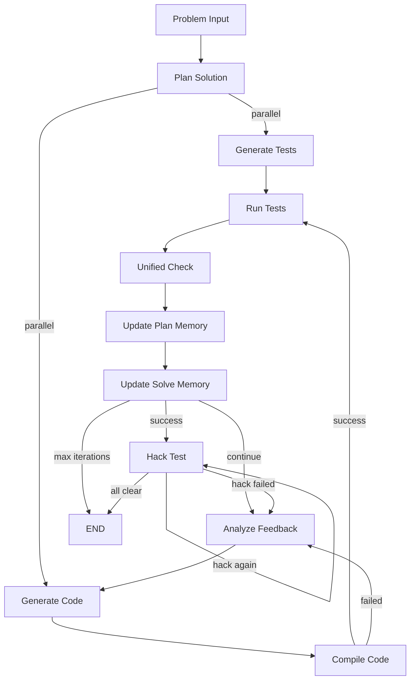

<div align="center">
  
  
  <h1 style="margin-top: 20px; font-size: 3em; color: #2c3e50;">Solvita</h1>
  <p style="font-size: 1.2em; color: #7f8c8d; margin-bottom: 30px;">
    <strong>Intelligent Competitive Programming Agent</strong>
  </p>

  [](https://www.python.org/downloads/)
  [](LICENSE)
  [](https://github.com/psf/black)
  [](https://pytest.org/)

  <br/>

  [Features](#-features) • [Architecture](#-architecture) • [Installation](#-installation) • [Quick Start](#-quick-start) • [Documentation](#-documentation)

</div>

---

## Introduction

**Solvita** is an autonomous agent for solving competitive programming problems (Codeforces-style). It combines a LangGraph workflow, a trainable contextual-bandit memory system, sandboxed C++ execution, and iterative SEARCH/REPLACE patching to automatically understand problems, generate tests, plan solutions, and produce passing C++ code.

---

## Features

<table>
<tr>
<td width="50%">

### Trainable Memory
Contextual-bandit network that learns which strategies work for which problem types across plan, solve, and test phases

### Multi-Model LLM Support
Works with any OpenAI-compatible API (GPT-4, Claude, local models) via a single config file

### C++ Sandboxed Execution
Resource-limited compilation and execution with `rlimit` sandboxing (CPU, memory, file size, process limits)

</td>
<td width="50%">

### Automatic Test Generation
Generates extensive test suites with generators, validators, and custom checkers

### SEARCH/REPLACE Patching
Iterative code repair via structured patches instead of full rewrites

### Adversarial Hack Testing
Post-success adversarial phase that stress-tests solutions to find edge-case bugs

</td>
</tr>
</table>

---

## Architecture



---

## Project Structure

```
solvita/
├── config/
│   └── models.yaml.example     # LLM configuration template
├── src/
│   ├── graph/
│   │   ├── state.py            # SolvitaState TypedDict
│   │   └── workflow.py         # LangGraph workflow definition
│   ├── llm/
│   │   └── unified_client.py   # OpenAI-compatible LLM client
│   ├── memory/
│   │   ├── types.py            # MemoryItem, Observation, MemoryEvent
│   │   ├── store.py            # SQLite-backed item/event storage
│   │   ├── policy.py           # Contextual bandit policy
│   │   ├── featurizer.py       # Canonical problem -> feature keys
│   │   ├── client.py           # Unified MemoryClient interface
│   │   ├── skill_loader.py     # C++ skill snippets from skills/*.md
│   │   └── seeds/              # Initial strategy templates
│   ├── nodes/
│   │   ├── plan_solution.py    # Problem analysis + canonical repr
│   │   ├── generate_code.py    # Code gen with SEARCH/REPLACE patching
│   │   ├── generate_tests.py   # Test suite generation
│   │   ├── compile_code.py     # Sandboxed compilation
│   │   ├── run_tests.py        # Sandboxed test execution
│   │   ├── unified_check.py    # Pass/fail determination
│   │   ├── analyze_feedback.py # Failure analysis + diagnostics
│   │   ├── hack_test.py        # Adversarial stress testing
│   │   ├── update_plan_memory.py
│   │   ├── update_solve_memory.py
│   │   └── routing.py          # Conditional edge logic
│   └── utils/
│       ├── cpp_execution.py    # rlimit-sandboxed compile/run
│       └── patch_utils.py      # SEARCH/REPLACE block parser
├── skills/                     # C++ algorithm snippets (*.md)
├── data/memory/                # SQLite databases + policy weights
│   ├── plan/  (memory.db, policy.json)
│   ├── solve/ (memory.db, policy.json)
│   └── test/  (memory.db, policy.json)
├── tests/
├── main.py                     # CLI entry point
└── requirements.txt
```

---

## Installation

### Prerequisites

- **Python 3.10+**
- **g++ or clang++** (C++17 support)
- An OpenAI-compatible LLM API endpoint

### Steps

```bash
# 1. Clone
git clone https://github.com/S0lvita/solvita.git
cd solvita

# 2. Install dependencies
pip install -r requirements.txt

# 3. Configure LLM credentials (choose one method)

# Option A: config file
cp config/models.yaml.example config/models.yaml
# Edit config/models.yaml with your base_url + api_key (+ optional llm.roles per node)

# Option B: environment variables
export SOLVITA_BASE_URL="https://api.openai.com/v1"
export SOLVITA_API_KEY="sk-..."
export SOLVITA_MODEL="gpt-4"
```

---

## Quick Start

### Python API

```python
from src.graph.workflow import run_workflow

result = run_workflow(
    raw_problem={
        "description": "Given an array, find two numbers that sum to target...",
        "time_limit": 2000,
        "space_limit": 256,
        "public_tests": [
            {"input": "5\n1 2 3 4 5\n6", "output": "1 5"},
        ],
    },
    config={
        "max_iterations": 5,
        "trainable_memory": {"enabled": True, "data_dir": "data/memory"},
    },
)

print(result["solution"]["code"])
print(f"Pass rate: {result['tests']['pass_rate']:.1%}")
```

### Command Line

```bash
python main.py --input problem.json --output solution.cpp
```

---

## Memory System

See [docs/memory_architecture.md](docs/memory_architecture.md) for full details.

The trainable memory uses a **contextual bandit** that learns which strategies work for which problem types. Active namespaces include `plan`, `solve`, `oracle`, and `hack` (the legacy `test` settlement path has been retired). Each active namespace has:

- **SQLite store** for items and events
- **Sparse linear policy** with feature-item edge weights
- **Event logging** for offline analysis and batch training

Formal offline Hacker trainer:

```bash
python3 scripts/train_hacker.py --dataset data/solvita_train/solvita_train_tanh.jsonl --data-dir data/memory
```

`scripts/train_hacker_input.py` is retained only as a legacy auxiliary script and is not the formal trainer.

---

## License

This project is licensed under the MIT License - see the [LICENSE](LICENSE) file for details.

---

## Acknowledgments

- [LangGraph](https://github.com/langchain-ai/langgraph) - Workflow orchestration
- [OpenAI](https://openai.com/) - GPT model support
- [Anthropic](https://www.anthropic.com/) - Claude model support
- [Codeforces](https://codeforces.com/) - Competitive programming platform

---
