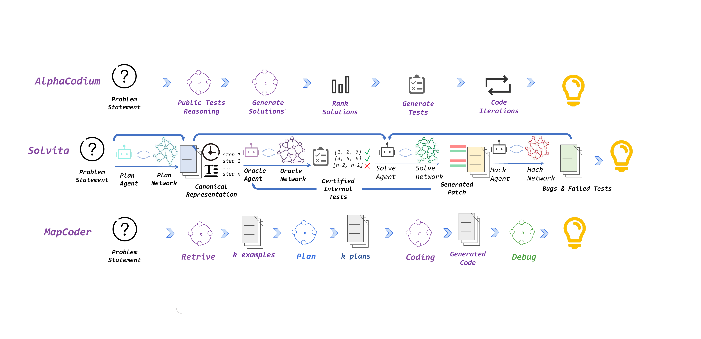

# Solvita

**Enhancing Large Language Models for Competitive Programming via Agentic Evolution**

[Paper](https://arxiv.org/abs/2605.15301) | [Repository](https://github.com/NJU-LINK/Solvita) | [API Docs](api.md) | [Memory Guide](MEMORY_SYSTEM_GUIDE.md)



## Overview

Solvita is an open-source framework for competitive-programming agents. It coordinates a Planner, Solver, Oracle, and Hacker in a closed solving loop, then updates role-specific knowledge networks from execution verdicts, certification signals, and adversarial failures.

The system is designed for frozen LLM backbones: the model itself does not need weight updates. Instead, Solvita learns which strategies, tests, repair patterns, and adversarial checks should be routed to future problems.

## Try Solvita

```bash
git clone https://github.com/NJU-LINK/Solvita.git
cd Solvita

python3 -m venv .venv
source .venv/bin/activate
pip install -r requirements.txt

cp config/models.yaml.example config/models.yaml
export SOLVITA_API_KEY="<your-api-key>"

python main.py --input examples/problem_input_example.json --output solution.cpp
```

For direct integration, use the Python API:

```python
from src.graph.workflow import run_workflow

result = run_workflow(problem, config={"max_iterations": 5})
print(result["solution"]["code"])
```

See [api.md](api.md) for Python, CLI, model-provider, REST, and WebSocket examples.

## Open Source

Solvita is released under the MIT License. Contributions are welcome through the GitHub repository. Before opening a pull request, install the repository hook with:

```bash
./scripts/install-git-hooks.sh
```

## Citation

```bibtex
@misc{li2026solvita,
  title         = {Solvita: Enhancing Large Language Models for Competitive Programming via Agentic Evolution},
  author        = {Han Li and Jinyu Tian and Rili Feng and Yuqiao Du and Chong Zheng and Chenyu Wang and Chenchen Liu and Shihao Li and Xinping Lei and Yifan Yao and Weihao Xie and Letian Zhu and Jiaheng Liu},
  year          = {2026},
  eprint        = {2605.15301},
  archivePrefix = {arXiv},
  primaryClass  = {cs.AI},
  url           = {https://arxiv.org/abs/2605.15301}
}
```
